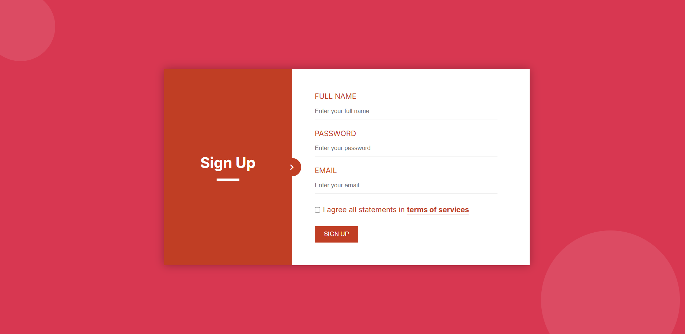

# Responsive Sign-Up Page

This project showcases a **mobile-first responsive Sign-Up page** designed using HTML and CSS. The page is optimized for different screen sizes, including mobile devices, tablets, and desktops. It features a stylish design with proper alignment, an interactive checkbox section, and smooth responsiveness.

## Features

- Mobile-first design to ensure responsiveness on smaller screens.
- Clean and modern layout with dynamic styling.
- Responsive checkbox section:
  - On smaller screens, the link moves to a new line.
  - On larger screens, the checkbox and link remain inline.
- **Custom icons** using **Google Material Symbols**.
- Accessibility features such as semantic HTML and proper labels.

## Screenshots

## Technologies Used

- HTML5 for semantic structure.
- CSS3 for styling and responsiveness.
- Google Fonts for custom typography.
- Material Symbols for modern icons.

## How to Use

- Clone the repository to your local machine and run the index.html page in your favorite browser.

## License

This project is licensed under the MIT License. You are free to use, modify, and distribute it.
